

<h1><kbd></kbd></h1>
Firebase Cloud Messaging sender extension. Developed by Hridoy.

## 📝 Specifications
* **
* 📦 **Package:** com.hridoy.fcmsender 
* 💾 **Size:** 15.05 KB 
* ⚙️ **Version:** 1.0.0 
* 📱 **Minimum API Level:** 14 
* 📅 **Updated On:** 26-05-2026 SAST
* 💻 **Built Using:** [FAST](https://community.appinventor.mit.edu/t/fast-an-efficient-way-to-build-publish-extensions/129103?u=jewel) <small><mark>v6.1.0</mark></small>

---

## All Blocks
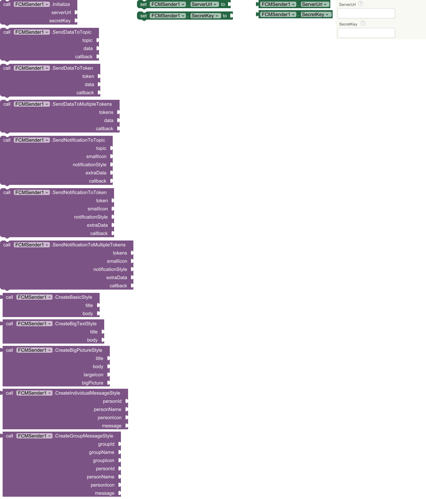

---

<kbd>Methods (12)</kbd>

### 1. Initialize

Initialize the sender with your server URL and secret key. Call this once at app startup. 

* serverUrl: full URL to deployed web-app. 
* secretKey: must match SECRET_KEY in your script.

| Parameter | Type
| - | - |
| serverUrl | text
| secretKey | text

### 2. SendDataToTopic
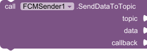

Sends a data-only message to all devices subscribed to a topic.
No notification is shown automatically — the app handles display.
Delivered to MessageReceived event on all subscribed devices.

---

**Parameters:**

* topic    — FCM topic name (without /topics/ prefix)
* data     — Dictionary of key-value pairs
* callback — procedure(success, messageId, error)

| Parameter | Type
| - | - |
| topic | text
| data | dictionary
| callback | any

### 3. SendDataToToken
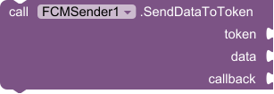

Sends a data-only message to a single device token.
No notification is shown automatically — the app handles display.
Delivered to MessageReceived event on the target device.

---

**Parameters:**

* token    — FCM registration token of target device
* data     — Dictionary of key-value pairs
* callback — procedure(success, messageId, error)

| Parameter | Type
| - | - |
| token | text
| data | dictionary
| callback | any

### 4. SendDataToMultipleTokens
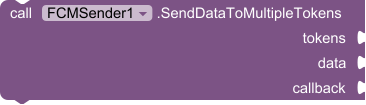

Sends a data-only message to multiple device tokens (up to 500).
No notification is shown automatically — the app handles display.
Delivered to MessageReceived event on each target device.

---

**Parameters:**

* tokens   — List of FCM registration token strings
* data     — Dictionary of key-value pairs
* callback — procedure(success, messageId, error)
messageId contains summary e.g. '5/5 sent'

| Parameter | Type
| - | - |
| tokens | list
| data | dictionary
| callback | any

### 5. SendNotificationToTopic
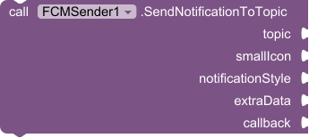

Sends a notification message to all devices subscribed to a topic.
Notification is built and shown by the receiver extension.
Delivered to NotificationReceived event on all subscribed devices.

---

**Parameters:**

* topic              — FCM topic name (without /topics/ prefix)
* smallIcon          — Small icon for status bar (Full HTTPS image URL or image in asset)
* notificationStyle  — Notification style (basic, big text, big picture, individual/group message)
* extraData          — Dictionary of extra key-value pairs
* callback           — procedure(success, messageId, error)

| Parameter | Type
| - | - |
| topic | text
| smallIcon | text
| notificationStyle | dictionary
| extraData | dictionary
| callback | any

### 6. SendNotificationToToken
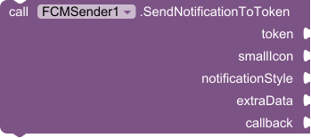

Sends a notification to a single device token.
Notification is built and shown by the receiver extension.
Delivered to NotificationReceived event on the target device.

---

**Parameters:**

* token        — FCM registration token of target device
* smallIcon          — Small icon for status bar (Full HTTPS image URL or image in asset)
* notificationStyle  — Notification style (basic, big text, big picture, individual/group message)
* extraData          — Dictionary of extra key-value pairs
* callback           — procedure(success, messageId, error)

| Parameter | Type
| - | - |
| token | text
| smallIcon | text
| notificationStyle | dictionary
| extraData | dictionary
| callback | any

### 7. SendNotificationToMultipleTokens
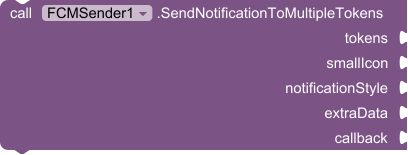

Sends a notification to multiple device tokens (up to 500).
Notification is built and shown by the receiver extension on each device.
Delivered to NotificationReceived event on each target device.

---

**Parameters:**

* tokens             — List of FCM registration token strings
* smallIcon          — Small icon for status bar (Full HTTPS image URL or image in asset)
* notificationStyle  — Notification style (basic, big text, big picture, individual/group message)
* extraData          — Dictionary of extra key-value pairs
* callback           — procedure(success, messageId, error)

| Parameter | Type
| - | - |
| tokens | list
| smallIcon | text
| notificationStyle | dictionary
| extraData | dictionary
| callback | any

### 8. CreateBasicStyle
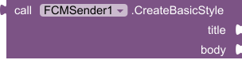

Creates a basic notification style dictionary configuration payload.

* Return type: `dictionary`

| Parameter | Type
| - | - |
| title | text
| body | text

### 9. CreateBigTextStyle

Creates an expanded big text style dictionary configuration payload.

* Return type: `dictionary`

| Parameter | Type
| - | - |
| title | text
| body | text

### 10. CreateBigPictureStyle
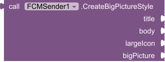

Creates an expanded big picture style dictionary configuration payload.

* Return type: `dictionary`

| Parameter | Type
| - | - |
| title | text
| body | text
| largeIcon | text
| bigPicture | text

### 11. CreateIndividualMessageStyle
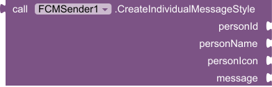

Creates an individual 1-on-1 MessagingStyle notification dictionary configuration layout.

* Return type: `dictionary`

| Parameter | Type
| - | - |
| personId | text
| personName | text
| personIcon | text
| message | text

### 12. CreateGroupMessageStyle
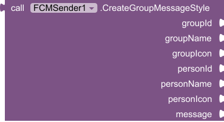

Creates a persistent group MessagingStyle notification dictionary configuration layout.

* Return type: `dictionary`

| Parameter | Type
| - | - |
| groupId | text
| groupName | text
| groupIcon | text
| personId | text
| personName | text
| personIcon | text
| message | text

---

<kbd>Properties (2)</kbd>

### 1. ServerUrl

 

Deployed web app url of google app-script

* Input type: `text`

### 2. SecretKey

 

Secret key that matches SECRET_KEY in your script

* Input type: `text`

## Usage

> ### 🚨 Important Notice

>This extension is not operational without a configured [Google Apps Script](https://script.google.com/home) backend.
> 
>You must complete the server setup before invoking any functionality.
> 
### Official documentation:

https://github.com/HB-Hridoy/FCM-Sender-AI2/wiki/Server-Setup

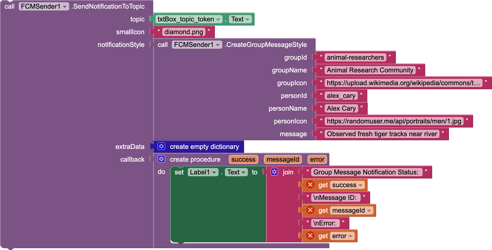

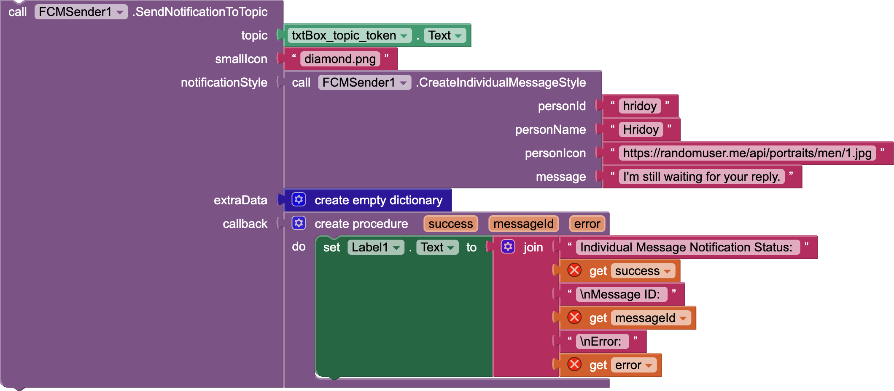

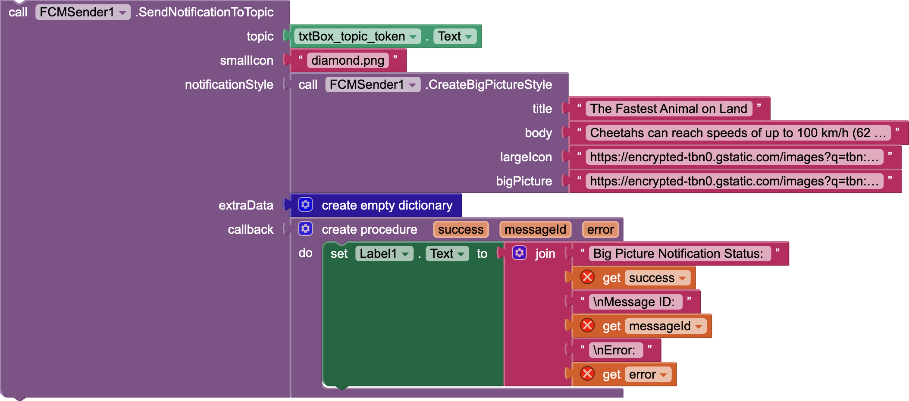

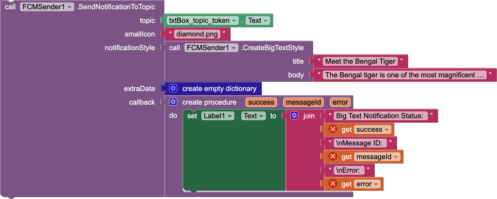

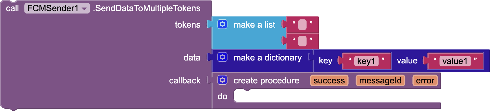

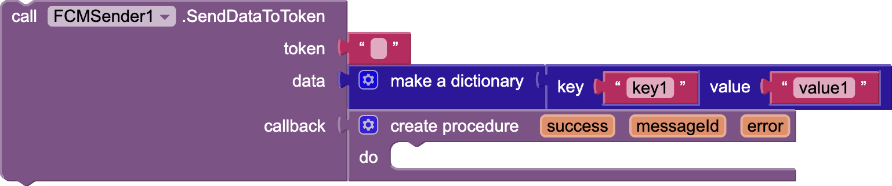

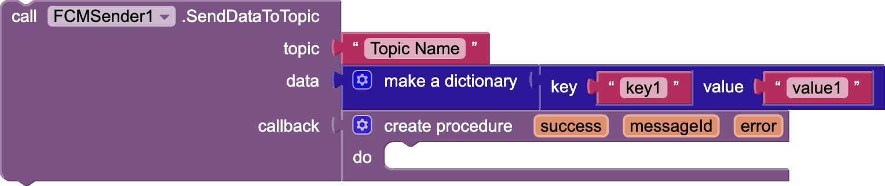

